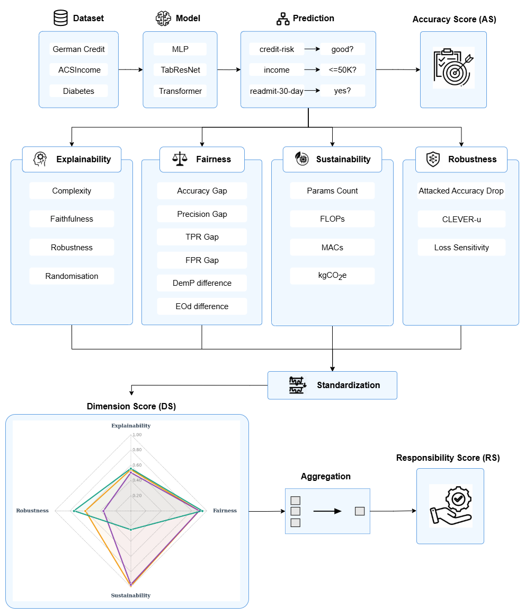
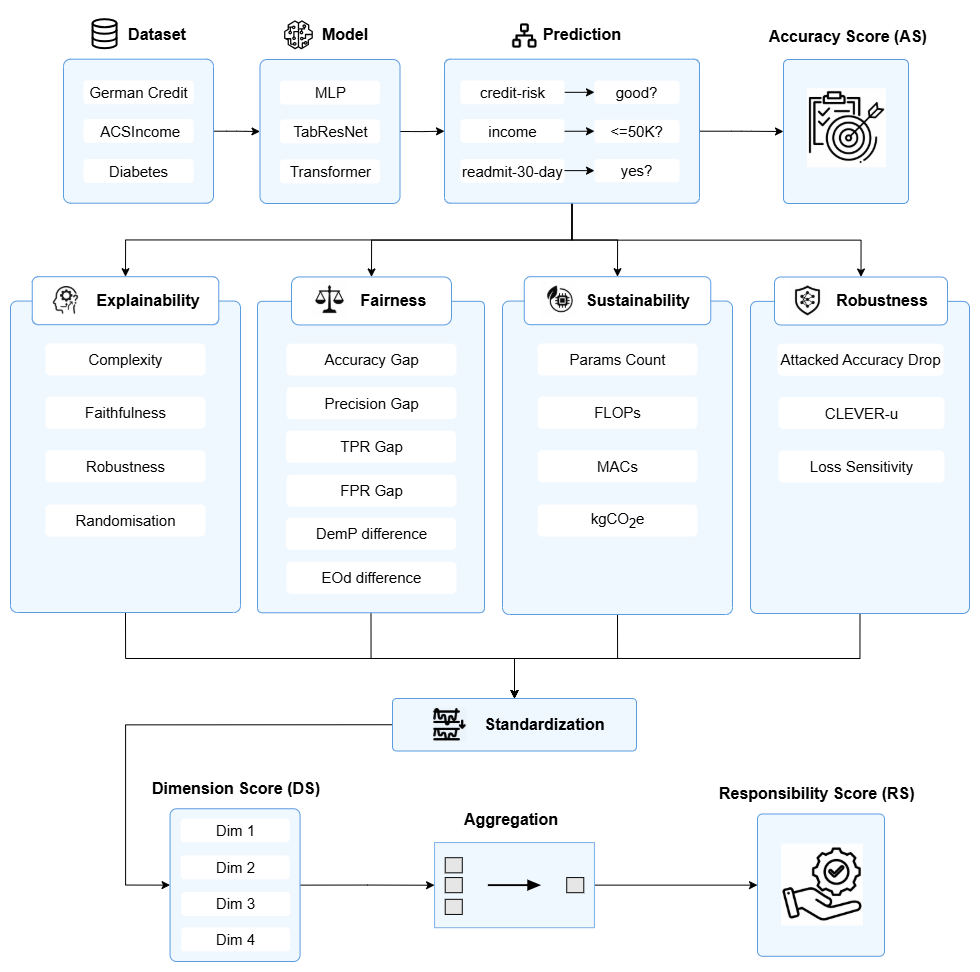

# RAISE: A Unified Framework for Responsible AI Scoring and Evaluation

## Table of Contents

- [Overview](#overview)
- [Metrics](#metrics)
- [Datasets & Results](#datasets--results)
- [Installation and Usage](#installation-and-usage)


## Overview

This is the official repository for **RAISE**, a comprehensive evaluation framework that enables multi-dimensional scoring of AI models across four pillars of responsible AI: 
- **Explainability**: Evaluates interpretability of model outputs using tools like SHAP and Captum
- **Fairness**: Assesses demographic parity, equal opportunity, and other fairness criteria
- **Robustness**: Tests resilience under adversarial perturbations and input noise
- **Sustainability**: Estimates environmental impact based on FLOPs and inference efficiency

As AI systems are deployed in high-stakes domains such as finance, healthcare, and socioeconomic decision-making, traditional evaluation based solely on accuracy is insufficient. The **RAISE** framework addresses this gap by providing:

- Modular evaluation tools for each responsibility dimension
- Consolidated **Responsibility Score** for holistic assessment
- Visualizations and benchmark results on real-world datasets

<p align="center">
  
</p>

<!--  -->


## Metrics

The RAISE pipeline consists of four core evaluation modules as follows:

<details>
<summary><strong>Explainability</strong></summary>

To evaluate the explainability of each model, we compute the following metrics using the `Quantus` toolbox:

**1. Complexity**  
Captures to what extent explanations are concise (i.e., using fewer features to explain a model prediction) - compute the following 2 metrics:
- **Sparseness** ([Chalasani et al., 2020]): Uses the Gini Index to assess whether highly attributed features are truly predictive.
- **Complexity** ([Bhatt et al., 2020]): Computes the entropy of the fractional contribution of each feature to the total attribution magnitude.

**2. Faithfulness**  
Quantifies how well explanations follow the model's predictive behavior (ensuring important features play a major role in outputs) - compute the following 2 metrics:
- **Faithfulness Correlation** ([Bhatt et al., 2020]): Replaces subsets of attributions with a baseline and measures correlation with output change.
- **Faithfulness Estimate** ([Alvarez-Melis et al., 2018]): Correlates attribution scores with output probability drops across multiple input points.

**3. Robustness**
Measures to what extent explanations are stable when subject to slight perturbations of the input, assuming that model output approximately stayed the same - compute the following metric: 
- **Local Lipschitz Estimate** (Alvarez-Melis et al., 2018): tests the consistency in the explanation between adjacent examples
- **Consistency** (Dasgupta et al., 2022): measures the probability that the inputs with the same explanation have the same prediction label

**4. Randomisation**
Tests to what extent explanations deteriorate as inputs to the evaluation problem e.g., model parameters are increasingly randomised - compute the following 2 metrics:
- **MPRT** (Model Parameter Randomisation Test) (Adebayo et. al., 2018): randomises the parameters of single model layers in a cascading or independent way and measures the distance of the respective explanation to the original explanation
- **Random** Logit Test (Sixt et al., 2020): computes for the distance between the original explanation and the explanation for a random other class

</details>


<details>
<summary><strong>Fairness</strong></summary>

To evaluate the fairness of each model, we compute six complementary sub-metrics using the `Fairlearn` library. These metrics measure disparities in predictions across sensitive groups (e.g., sex/gender):

**1. Accuracy Difference**  
Computes the difference in accuracy across sensitive groups:
- Derived from `accuracy_score` per group via `MetricFrame`  
*A fair model should achieve similar accuracy across all demographic groups.*

**2. Precision Difference**  
Measures the disparity in precision (positive predictive value) between groups:
- Derived from `precision_score` per group  
*High differences may indicate bias in positive prediction reliability.*

**3. True Positive Rate (TPR) Difference**  
Calculates disparity in the rate of correctly identifying positives across groups:
- Approximated via `1 - false_negative_rate` per group  
*A low TPR difference indicates the model treats all groups equally in identifying positives.*

**4. False Positive Rate (FPR) Difference**  
Measures the difference in incorrect positive predictions across groups:
- Derived from `false_positive_rate` via `MetricFrame`  
*Minimizing FPR differences helps prevent disproportionate false alarms.*

**5. Demographic Parity Difference**  
Measures the difference in selection rates (i.e., predicted positive rate) across groups:
- **Metric**: `demographic_parity_difference`  
*A value closer to 0 indicates more balanced treatment across sensitive groups.*

**6. Equalized Odds Difference**  
Captures the maximum difference in both false positive rates (FPR) and true positive rates (TPR) across groups:
- **Metric**: `equalized_odds_difference`  
*Fair models should exhibit low differences in both FPR and TPR between groups.*

All fairness metrics are normalized to the \([0, 1]\) range, where **0 indicates perfect fairness**.

</details>


<details>
<summary><strong>Sustainability</strong></summary>

To assess the environmental impact and resource efficiency of each model, particularly during inference, we evaluate four key sustainability metrics that reflect compute cost, model size, and estimated carbon emissions:

**1. Number of Parameters**  
Represents the model’s memory footprint and storage requirements. Larger models typically require more energy to store and load, contributing to higher emissions.

**2. Floating Point Operations (FLOPs)**  
Estimates the total number of arithmetic operations performed in a single forward pass. Higher FLOPs indicate greater computational cost and energy consumption.

**3. Multiply–Accumulate Operations (MACs)**  
Measures the actual compute operations required by hardware (e.g., GPUs), offering a lower-level estimate of processing demand and efficiency.

**4. Estimated Carbon Emissions (Lacoste Score)**  
Calculates estimated CO₂ equivalent emissions based on average CPU and GPU power usage:
- **Power usage** is computed as:  
    **p<sub>t</sub> = (p<sub>c</sub> + p<sub>g</sub>) / 1000**,  
    where *p<sub>c</sub>* and *p<sub>g</sub>* are the average CPU and GPU power draw in watts.  

- The energy usage is then multiplied by Germany’s 2022 average CO₂ intensity of **0.498 kg/kWh**.

- The final **CO₂ emissions** are normalized by Germany's average **daily per capita emission** of **26 kg**, as reported by [European Commission 2023](https://edgar.jrc.ec.europa.eu/).

Higher normalized sustainability scores indicate **greater energy efficiency** and **lower environmental impact**.

</details>


<details>
<summary><strong>Robustness</strong></summary>

To evaluate the stability of each model explanations under small input perturbations or adversarial noise are applied to the test data, we compute the following three metrics using the Adversarial Robustness Toolbox (ART):

**1. Accuracy Gap under Adversarial Attack**  
Assesses how much the model's performance degrades when subjected to adversarial inputs:
- **FGSM Accuracy Gap** ([Goodfellow et al., 2015]): The model is attacked using the Fast Gradient Sign Method (`FastGradientMethod` from `art.attacks.evasion`). The score is computed as the drop in test accuracy due to the attack.  

**2. CLEVER-u Score**  
Estimates the minimum perturbation required to change the model prediction:
- **CLEVER-u** ([Weng et al., 2018]): A lower bound on the size of perturbations needed to cause misclassification, serving as a theoretical robustness certificate.  

**3. Loss Sensitivity**  
Evaluates the smoothness of the model’s loss landscape under input perturbations:
- **Loss Sensitivity**: Measures how rapidly the loss changes in response to small input changes.  

</details>


These 4 dimension scores are aggregated into a unified **Responsibility Score** to support responsible model selection and deployment.


## Datasets & Results

The RAISE framework has been applied to three following tabular datasets, with evaluation results reported for three model types: **MLP**, **TabResNet**, and **FT-Transformer**.

- **Credit**: A financial dataset for credit default classification.
- **Diabetes**: A healthcare dataset predicting diabetes onset based on diagnostic features.
- **Income**: A socioeconomic dataset predicting whether income exceeds $50K/year based on census attributes.

<div align="center">

<table>
  <thead>
    <tr>
      <th>Dataset</th>
      <th>Model</th>
      <th>Accuracy</th>
      <th>Responsibility Score</th>
    </tr>
  </thead>
  <tbody>
    <tr><td>Credit</td><td>MLP</td><td>0.80</td><td>0.76</td></tr>
    <tr><td></td><td>TabResNet</td><td>0.82</td><td>0.68</td></tr>
    <tr><td></td><td>Transformer</td><td>0.80</td><td>0.62</td></tr>
    <tr><td>Diabetes</td><td>MLP</td><td>0.89</td><td>0.88</td></tr>
    <tr><td></td><td>TabResNet</td><td>0.89</td><td>0.87</td></tr>
    <tr><td></td><td>Transformer</td><td>0.89</td><td>0.62</td></tr>
    <tr><td>Income</td><td>MLP</td><td>0.82</td><td>0.83</td></tr>
    <tr><td></td><td>TabResNet</td><td>0.85</td><td>0.86</td></tr>
    <tr><td></td><td>Transformer</td><td>0.85</td><td>0.71</td></tr>
  </tbody>
</table>

</div>


<!-- | Dataset   | Model         | Accuracy | Responsibility Score  |
|-----------|---------------|----------|-----------------------|
| Credit    | MLP           | 0.80     | 0.76                  |
|           | TabResNet     | 0.82     | 0.68                  |
|           | Transformer   | 0.80     | 0.62                  |
| Diabetes  | MLP           | 0.89     | 0.88                  |
|           | TabResNet     | 0.89     | 0.87                  |
|           | Transformer   | 0.89     | 0.62                  |
| Income    | MLP           | 0.82     | 0.83                  |
|           | TabResNet     | 0.85     | 0.86                  |
|           | Transformer   | 0.85     | 0.71                  | -->

Figures for the scores of each dataset across all models can be found in the [`figures/`](./figures) directory.


## Installation and Usage
Clone the repository:

```bash
git clone https://github.com/raise-framework/raise.git
cd raise
``` 

Install dependencies with:

```bash
pip install -r requirements.txt
```

Run each notebook individually.

<!-- 
## Contributing and License

We welcome contributions to RAISE! If you discover bugs, have suggestions, or want to add features, feel free to open an issue or submit a pull request.

This project is distributed under the [MIT License](LICENSE), allowing free use, modification, and redistribution with appropriate credit.

For questions about contributing, licensing, or collaboration, contact us at:  
📧 [loc.pt.nguyen@fau.de](mailto:loc.pt.nguyen@fau.de)  
📧 [hung.t.do@fau.de](mailto:hung.t.do@fau.de) -->

